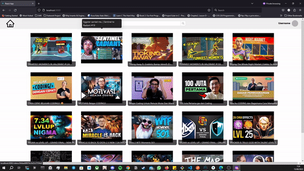
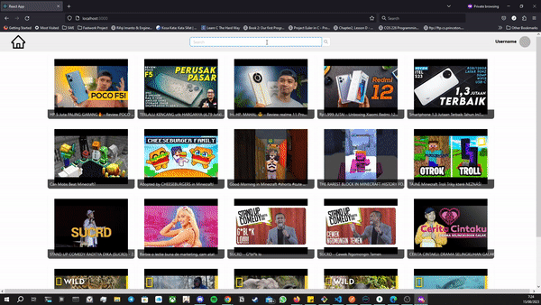
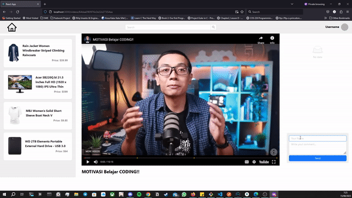
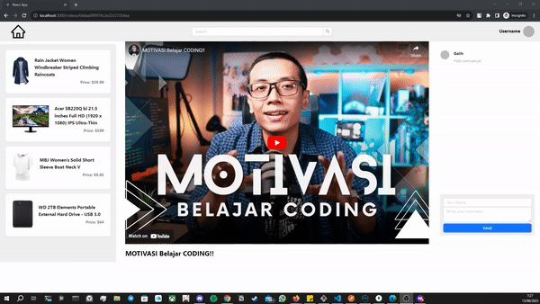

# Tokopedia Play Clone Client

## Description

This is the client-side application for Tokopedia Play Clone Generasi Gigih mid-term assignment that is the part of the final-project assignment. In this application users can watch and interact with videos, live comments, and see related products in the video. The reference can be viewed in [Tokopedia Play](https://www.tokopedia.com/play/channels)

## Table of Contents
- [Features](#features)
- [Technologies Used](#technologies-used)
- [Getting Started](#getting-started)
  - [Prerequisites](#prerequisites)
  - [Installation](#installation)
- [Usage](#usage)
  - [Video Playback](#video-playback)
  - [Search Functionality](#search-functionality)
  - [Live Comments](#live-comments)

## Features
Some feature implemented in this app are:
- Browse and watch videos from the server
- Leave live comments on videos
- Explore related products associated with each video
- Search for videos based on keywords

## Technologies Used
- React: Frontend framework for building user interface
- Ant Design: UI component library
- Axios: HTTP client for making API request
- Socket.io: Real-time communication library for live comments
- Youtube Iframe API

## Getting Started

### Prerequisites
- Node.js and `npm` (Node Package Manager) installed
- Server side folder in the parent folder

### Installation
To install this project you need to follow this steps:

#### 1. Clone the repository: 
```bash
git clone https://github.com/Josh282/mid-term.git
```

#### 2. Install dependecies:
Use node package manager to install the dependecies in `package.json`:
```bash
cd /mid-term/client
npm install
```

### Running the Application Locally
To run this application on your local machine, follow these steps:

#### Prerequisites
Before you begin, ensure you have following the instruction to run the server-side from parent folder that can be found here [README.md](../README.md). After that ensure that your server-side and client-side is using different port. In this application the default port set is `localhost:5000` for server and `localhost:3000` for client.

#### 1. Start the development server and client:
```bash
# Server Development
cd ../
npm run dev
```

```bash
# Client Server
cd ./client
npm start
```

#### 2. Access the application
Navigate to the URL of the port you used for client in the browser to access the application. The default is `http://localhost:3000`


## Usage
#### Video Playback
- Follow the [Access the application](#2-access-the-application)
- Pick a video of your choice, the page will redirect you to the video detail page
- Play the YouTube video


#### Search Functionality
- Enter keywords in the search bar to search for videos
- Click on search results to view related videos


#### Live Comments
- Play a video and leave comments in the comment section.
- Comments will be displayed in real-time for all viewers.




